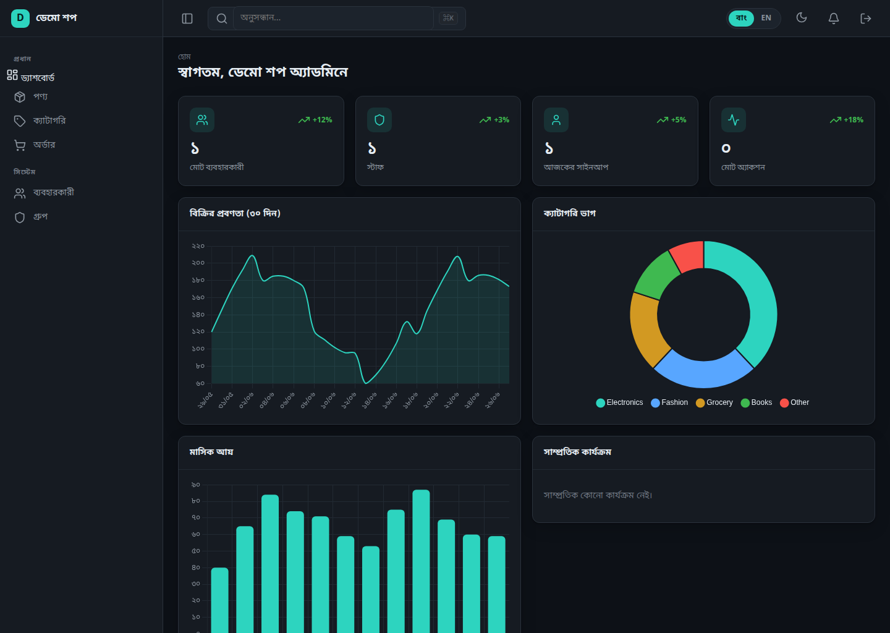
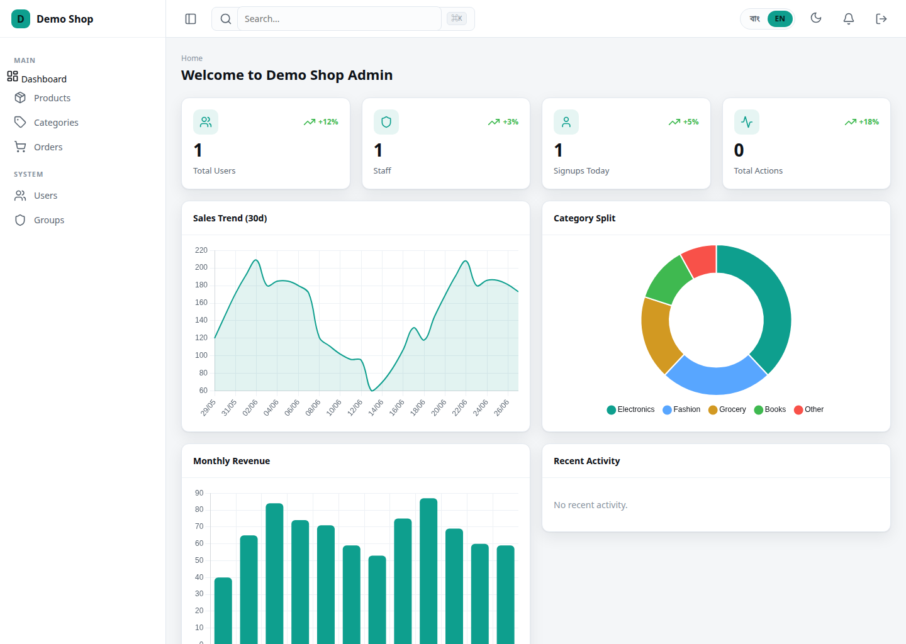
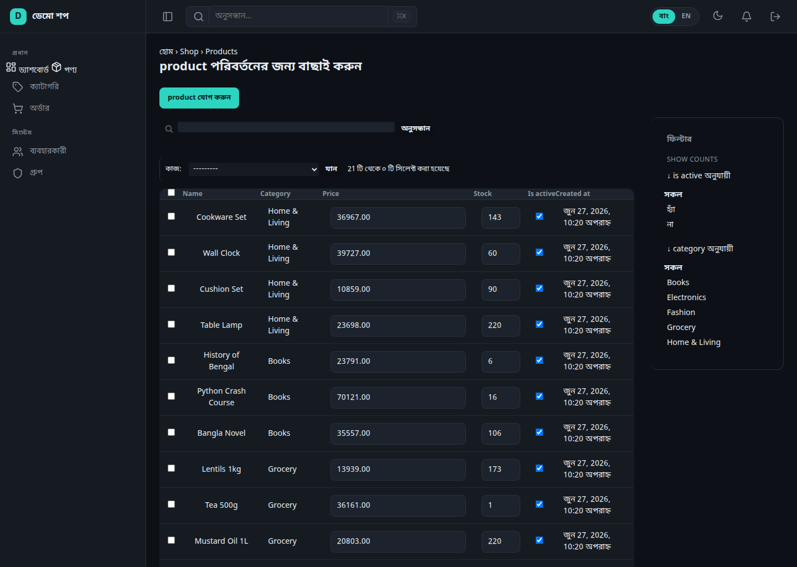

# django-bangla-admin

> A free, open-source, reusable **Django admin theme & dashboard** built for a
> Bangladeshi audience. SPA-feel via HTMX, live Chart.js dashboards,
> **Bangla ⇄ English** language switching, and a single config dict — no
> template editing for basic use.

[](LICENSE)
[](https://www.djangoproject.com/)



<p align="center">
  
  
</p>

---

## Features

- 🎨 **Drop-in theme** — install, add to `INSTALLED_APPS`, point your URLs at it. No template edits required.
- ⚙️ **One config dict** (`BANGLA_ADMIN`) controls branding, menu, colors, dashboard.
- ⚡ **SPA feel, no JS framework** — HTMX partial navigation; the admin never full-reloads.
- 🇧🇩 **First-class Bangla** — full Bn/En UI, instant cookie-based toggle, Bengali font stack, Bangla numerals (০১২৩).
- 📊 **Live dashboard** — stat cards, line / doughnut / bar charts (Chart.js), activity feed; charts recolor on theme/lang change.
- 🌗 **Dark default + light mode** — persisted toggle; charts and components follow.
- 📦 **Zero-build, offline-friendly** — prebuilt CSS, self-hosted fonts, vendored HTMX / Alpine / Chart.js. No CDN. Works on BDIX / offline VPS.

## Installation

```bash
pip install django-bangla-admin
```

```python
# settings.py
INSTALLED_APPS = [
    "django_bangla_admin",      # BEFORE django.contrib.admin
    "django.contrib.admin",
    # ...
]

# i18n (the Django 4.2+ correct way — cookie + LocaleMiddleware)
USE_I18N = True
LANGUAGE_CODE = "bn"
LANGUAGES = [("bn", "বাংলা"), ("en", "English")]

MIDDLEWARE = [
    # ...
    "django.contrib.sessions.middleware.SessionMiddleware",
    "django.middleware.locale.LocaleMiddleware",          # after Session, before Common
    "django.middleware.common.CommonMiddleware",
    # ...
    "django_bangla_admin.middleware.HtmxShellMiddleware",  # strips shell on HX-Request
]

# Add the context processor for theme/language in templates
TEMPLATES[0]["OPTIONS"]["context_processors"] += [
    "django_bangla_admin.context_processors.bangla_admin",
]

BANGLA_ADMIN = {"site_title": "My Shop Admin", "default_language": "bn"}
```

```python
# urls.py
from django.urls import path
from django_bangla_admin.sites import urls as ba_urls

urlpatterns = [path("admin/", ba_urls)]
```

That's it — a fully themed, Bangla, HTMX-driven admin with charts. Your existing
`@admin.register` / `admin.site.register` calls work unchanged: the themed site
mirrors the default admin registry automatically.

## Configuration

A single `BANGLA_ADMIN` dict, deep-merged over the defaults:

```python
BANGLA_ADMIN = {
    # Branding
    "site_title": "Bangla Admin",
    "site_brand": {"bn": "বাংলা অ্যাডমিন", "en": "Bangla Admin"},
    "welcome_sign": {"bn": "স্বাগতম", "en": "Welcome"},

    # Theme
    "theme": "dark",                 # "dark" | "light"
    "allow_theme_toggle": True,
    "primary_color": "#2DD4BF",

    # Language
    "default_language": "bn",
    "allow_language_toggle": True,
    "bangla_numerals": True,

    # Navigation — omit `menu` to auto-build from registered models
    "menu": [
        {"section": {"bn": "প্রধান", "en": "Main"}},
        {"label": {"bn": "ড্যাশবোর্ড", "en": "Dashboard"},
         "icon": "layout-dashboard", "url": "bangla_admin:index"},
        {"label": {"bn": "অর্ডার", "en": "Orders"},
         "icon": "shopping-cart", "model": "shop.Order"},
    ],
    "icons": {"auth.User": "user"},  # per-model Lucide icons
    "hide_apps": [], "hide_models": [],

    # Dashboard
    "dashboard": "django_bangla_admin.dashboard.default.DefaultDashboard",
    "show_dashboard": True,
}
```

Read values anywhere via `from django_bangla_admin.conf import ba_conf` → `ba_conf("theme")`.

## Custom dashboards

```python
from django_bangla_admin.dashboard import Dashboard, StatCard, ChartWidget, ListWidget

class MyDashboard(Dashboard):
    widgets = [
        StatCard(label={"bn": "অর্ডার", "en": "Orders"},
                 value=lambda r: Order.objects.count(), icon="shopping-cart", trend="+8%"),
        ChartWidget(id="sales", kind="line",
                    title={"bn": "বিক্রি", "en": "Sales"},
                    data_url="bangla_admin:ba_chart_data", params={"metric": "sales"}),
    ]
```

Point `BANGLA_ADMIN["dashboard"]` at it. Register custom chart metrics with
`@register_metric("name")` from `django_bangla_admin.dashboard.data`, returning
`{"labels": [...], "datasets": [...]}`.

## Demo project

```bash
cd example
python manage.py migrate
python manage.py seed_demo      # creates admin/admin + sample shop data
python manage.py runserver
```

Open <http://127.0.0.1:8000/admin/> and log in with **admin / admin**.

## Development

```bash
pip install -e .
python -m django test tests --settings=tests.settings   # run the suite
python scripts/compile_messages.py                       # compile .po -> .mo (no gettext needed)
```

## Tech

HTMX 2 · Alpine.js 3 · Chart.js 4 · self-hosted Hind Siliguri / Inter fonts ·
Django 4.2 LTS → 5.x.

## License

MIT © [Ifte Samul Ohy](https://iftesamulohy.com)
